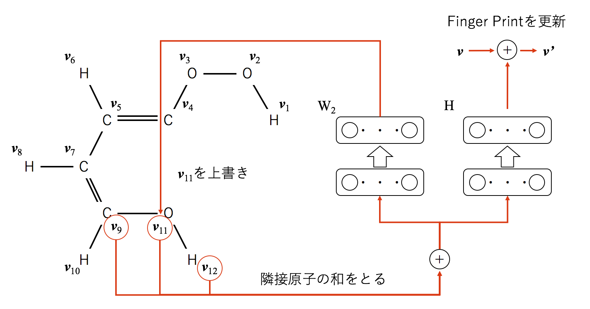
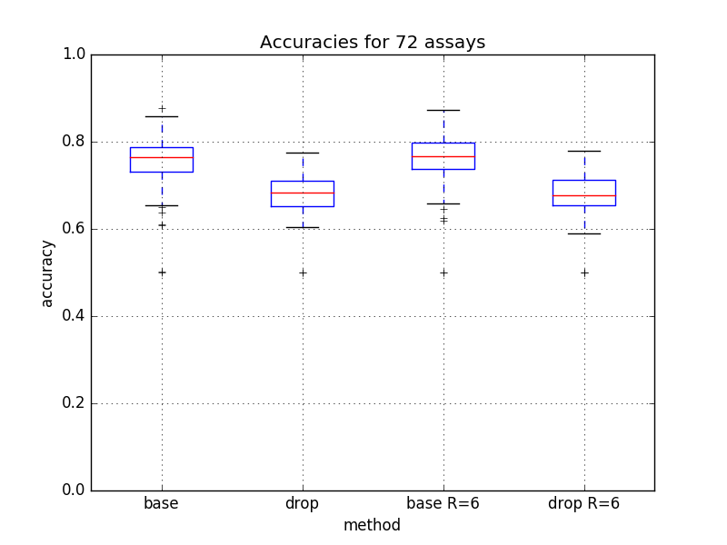
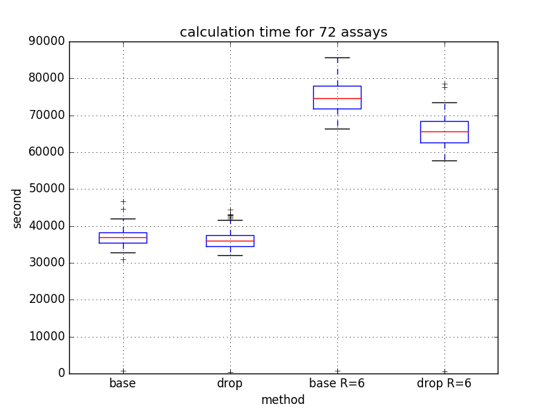

<link href="style.css" rel="stylesheet"></link>

# 平成27年度 TSUBAME産業利用トライアルユース 成果報告書


利用課題名：大規模分散深層学習の創薬への応用（Application of Massive Distributed Deep Learning toward Drug Discovery）

株式会社 Preferred Networks（Preferred Networks, Inc.）

https://www.preferred-networks.jp/

## 邦文抄録

 本プロジェクトでは、深層学習による表現学習の創薬への応用として、化合物のFinger Printを学習ベースで獲得するNeural Finger Print（NFP）を再現し、さらにその乱択アルゴリズム化であるDrop Edgeを提案した。さらに、両者の化合物活性予測のタスクをTSUBAME上で実施し、予測精度と速度を比較した。72アッセイの化合物活性予測に対してNFPとDrop Edgeを適用し、特に半径（アルゴリズム中のイテレーション回数）が大きい場合に、1割程度の計算時間削減を確認した。一方で、予測精度はDrop Edgeの方が1割程度低い（Accuracyで比較）という結果も得られた。計算量と予測精度のトレードオフの解消は今度の課題である。

## 英文抄録

This project explores an application of representation learning by deep learning toward drug discovery. Specifically, we reproduce Neural Finger Print (NFP), which learns the finger print of compounds from data, and propose the randomized algorithm of NFP, called Drop Edge. We apply these two methods to the activity prediction task of 72 assays and find that Drop Edge can reduce the time complexity, especially when the radius is large, by approximately 10%. On the other hand, prediction accuracy is also reduced by approximately 10%. So there remains the trade-off between time complexity and accuracy.

## Keywords
Neural Finger Print、機械学習、深層学習、QSAR

## 概要

本プロジェクトではまずNFPの再現を行った。我々の再現では、NFPは非常に計算コストが高く、そのままの手法で大規模化するのは難しいと考えた。そこで、本プロジェクトの2つ目の取り組みとして、NFPの手法を乱択アルゴリズム化し、計算量を落とす手法 Drop Edgeを提案し、NFPとの計算量・精度の比較を行った。

## 背景と目的

　定量的構造活性相関(Quantitative Structure-Activity, QSAR)は化合物の化学的な性質と毒性や体内の酵素に対する代謝の度合いなど、生化学的性質間の量的な関連を指す。QSARは創薬での候補化合物探索おいて、初期のスクリーニングに利用される。精度の良いQSARは、スクリーニング精度向上に貢献し、創薬コストの削減、化合物のヒット率上昇につながる。

　化合物の探索空間全体は1060程度と言われており[Bohacek+96]、これらの活性をすべて実験するのは現実的ではない。そこで探索の初期では、計算機上で化合物ライブラリ中の候補化合物のQSARを予測するVirtual Screeningの手法を取り入れるのが一般的である。

　化合物と受容体の結合の様子をシミュレーションするドッキングシミュレーションを初めとして、様々なVirtual Screeningの手法が開発されている。その中でも特に深層学習によるVirtual Screeningの手法が近年注目を集めている。深層学習は層が深いニューラルネットワークを用いた機械学習の手法の総称であり、
動画像解析（検出・認識）・自然言語処理（翻訳・対話）など様々な分野のタスクで既存の手法を超える予測精度が報告されている。

　これまでに、深層学習を用いた化合物の活性予測として[Dahl+14], [Thomas+14], [Divenaud+15]などの研究がある。[Dahl+14]の手法は、化合物の構造式をFinger Printと呼ばれる固定長のビットベクトルに変換し、Finger Printから特定のターゲットに対する活性の有無を予測する2値分類問題を、ニューラルネットを用いて解いている。さらに、複数のターゲットに対する活性予測を共通のニューラルネットで予測する、マルチタスク学習を行うことで予測精度が向上することを報告した。同様のマルチタスク深層学習による活性予測は[Thomas+14]などでも行われている。

　いずれも研究でも化合物の構造式からFinger Printへの変換方法には大きな注目をしていなかった。[Dahl+14]が利用している商用ソフトウェアDRAGONは、Finger Printのビットごとに、そのビットを立てる条件をルールベースで記述している。また、[Thomas+14]では、標準的なFinger Printの構築アルゴリズムのExtended-connectivity fingerprint (ECFP)を利用している。いずれも、なぜそのFinger Printを利用するかについては特に言及はしていなかった。

　今日の深層学習の成功の理由の1つとして、表現学習、すなわち、学習ベースによる入力データの特徴抽出を高精度に行えることが挙げられることが多い。構造式からFinger Printへの変換を特徴抽出と捉えれば、Finger Printを学習ベースで獲得するのは自然な発想だと言える。[Divenaud+15]では化合物を複数種類のノードから構成されるグラフとして捉え、グラフ上の畳み込み演算としてFinger Printを獲得する手法、Neural Finger Print (NFP)を提案した。

## 手法

　まず、ECFP, NFP, Drop Edgeの手法を解説する。

　ECFPは、化合物を長さdの固定長のビットベクトルに変換する決定的なアルゴリズムである。予め可変長の引数を取り1つの整数値を返すハッシュ関数を用意して固定する。まず、各原子に初期ハッシュ値を割りあてる。この値は原子の種類が同一ならば同一の値を割り振る。また、出力のビットベクトルの全ビットを0に初期化する。次に、分子中のそれぞれの原子に対し、その原子自身とその原子に隣接する原子達に割り当てられたハッシュ値を集め、ハッシュ関数に適用する。原子に割り振られたハッシュ値をその出力値で更新する。また、ここで得られた出力値をdで割った剰余を計算し、ビットベクトルの対応するビットを1に立てる。分子中の全原子に対してこのハッシュ値の更新を同時に行う過程を1イテレーションとし、これを決められたイテレーション数R回行う。R回のイテレーションを行った後に得られた後のビットベクトルをこの化合物のFinger Printとする。R回のイテレーションを行うと、ある原子からRだけ離れた原子の情報まで含めてFinger Printを作成するので、イテレーション数Rを半径（radius）と呼ぶ。

　NFPの構築アルゴリズムはECFPのそれと共通部分が多いが以下の点が異なる。図1はECFPとNFPの手法の擬似アルゴリズムの比較である。

* ECFPでは各原子にはハッシュ値を割り振るのに対し、NFPでは長さfの実数値ベクトルを用いる。
* ECFPでは各原子の値の更新にハッシュ関数を用いるのに対し、NFPでは1層のニューラルネットを用いる。
* ECFPで原子と隣接する原子達のハッシュ値を連結してハッシュ関数に適用した代わりに、すべてのベクトルの和を取りニューラルネットに入力する。
* Finger Printに値を追加する際、ECFPでは剰余に対応する特定の1ビットが1で残りが0という、ハードな割り当てを行う。それに対し、NFPでは1層のニューラルネットを用いて確率分布（すなわち各要素は0以上で合計が1の出力）によるソフトな割り当てを行う。
<figure>

<figcaption>図1：ECFP（左）とNFP（右）の比較（[Duvenaud+15]より引用）
</figcaption>

</figure>

　化合物の最大次数をNとする。NFPでは、予め、長さfのベクトルを長さdのベクトルに変換するニューラルネットHと、各次数n (n=1,...N)に対し、長さfのベクトルを同じ長さfのベクトルに変換するニューラルネットWnを用意する。Hは各要素が0以上で要素の合計が1になるように正規化され、出力が確率として解釈できるようにする。典型的には、Wnは1層の全結合層 + 活性化関数、Hは1層の全結合層 + Softmax関数で実現される。

　具体的な構築アルゴリズムは以下の通りである。まず、各原子を原子の種類ごとに長さfの実数値ベクトルで初期化する。また、Finger Printを長さdの0ベクトルで初期化する。次に、分子中のそれぞれの原子に対し、その原子自身とその原子に隣接する原子達に割り当てられたベクトルの和をとり、Wnにフォワードする。ここで、nはこの原子の隣接する原子の数（次数）である。また、同時にこの和をHにもフォワードし、出力値をFinger Printに足す。分子中の全原子に対してこのハッシュ値の更新を同時に行う過程を1イテレーションとし、これを決められたイテレーション数R回行う。

　図2は特定の1原子に割り当てられたベクトル（v11）の更新とアルゴリズムの出力であるFinger Print（v）の更新を図示したものである。
<figure>

<figcaption>図2：NFPでのベクトル更新
</figcaption>

</figure>

　最後に、NFPの乱択化であるDrop Edgeを解説する。NFPでは、ある原子に割り振られた長さfの実数値ベクトルを更新する際、その原子に隣接するすべての原子のベクトルを用いた。Drop Edgeでは、隣接する全ての原子を用いる代わりに、ランダムに1個の原子を選びそれのみを利用する。化合物をグラフと見た時の最大次数をNとすると、NFPでは、N+1 種類のニューラルネット(W1, …, WN, H)を用意する必要があった。それに対して、Drop Edgeで用意すべきニューラルネットは2つのみである。これにより学習すべきパラメータ及びメモリ使用量が減少する。また、NFPに比べ行列計算の回数が減るので、所要時間が削減されることが期待出来る。もちろん、乱択化により訓練時に利用する情報は減少するため、予測モデルの精度が落ちる可能性がある。実験では乱択化による精度劣化の度合いを検証した
 
## 実験

　72アッセイに対して、化合物の活性の有無を予測する2値分類問題をNFPとDrop Edgeを用いて解き、その精度と実行速度を比較した。
　
　モデルは、Finger Printの生成する生成器と、生成したFinger Printを用いて活性の有無を予測する分類器の2つからなる。生成器としてNFPまたはDrop Edgeを用い、分類器はニューラルネットを用いてモデル化している。

　学習は、生成器を学習するTrainingステップと、生成したFinger Printを評価するValidationステップの2つに分かれている。それぞれのステップに対し、Trainingデータセット3500個と、Testデータセット500個の化合物を用意する（すなわち1アッセイあたり合計 (3500 + 500) x 2 = 8000個の化合物を利用する）。Trainingデータセットは分類器を学習に、Testデータセットは分類精度を評価に用いる。それぞれのデータセットには活性ありとなしが半数ずつ含まれるようにした。

　生成器はTrainingステップのみで更新を行い、Validationステップでは生成器を学習させないようにする。分類器はすべてのデータセットに関して更新を行う。前のEpochでのValidationステップでの分類器の学習を通じて、Validationデータセットでの情報が生成器の方に次のEpochで伝わってしまうため、本来は分類器の重みはTrainingステップとValidationステップの間で初期化すべきであるが、今回は実験時間の都合上、その実験は実施しなかった。初期化の有無による精度変化は今後の検討事項の1つである。

　本実験に利用したコードを以下のURLで公開している。レポジトリのnfpディレクトリにNFPの、drop_edgeディレクトリにDrop Edgeを実装している。
URL：https://github.com/pfnet/nfp/
結果および考察

## 結果および考察

　実験は以下のようなパラメータで行った。後述の結果の通り、この実験設定で、1つのアッセイの実験に10-20時間程度要する。

* Finger Print長 d：128
* 特徴ベクトルの長さ f：128
* 半径 R：3または6
* 分類器ニューラルネットの中間層のノード数：256
* ミニバッチサイズ：50
* TrainingステップでのTrainingデータセットによる学習のエポック数：15
* ValidationステップでのTrainingデータセットによる学習のエポック数：20
* 全体のエポック数：15

　図3は72アッセイに対するValidationステップのTestデータセットに対するAccuracyの15エポックのうちの最大値をプロットしたものである。baseは従来手法、dropはDrop Edgeであり、R=6と書かれているものは半径Rを6に設定したもの、書かれていないものは半径Rを3に設定したものである。Drop Edgeの精度は従来手法のおよそ0.9倍に落ちている。半径Rを増やすことによって、より遠い距離の隣接関係に関する情報がNFPに含まれることになり、精度が向上することを予想していたが、精度に大きな変化は見られなかった。
<figure>

<figcaption>図3：Accuracyの最大値のbox plot</figcaption>

</figure>

　図4は72アッセイに対する計算時間をプロットしたものである。本手法の計算量は半径Rに比例するものであり、実際の所要時間でもR=6の所要時間は、R=3の倍程度時間がかかっている。NFPとDrop Edgeの所要時間を比較すると、R=3では大きな改善は見られなかったが、R=6では、1割程度の所要時間削減がなされていることがわかる。
<figure>

<figcaption>図4：実行時間のbox plot（横軸の単位は秒）</figcaption>

</figure>

## まとめ、今後の課題

　本プロジェクトでは、深層学習による表現学習の創薬への応用として、化合物のFinger Printを学習ベースで獲得するNeural Finger Print (NFP)を再現し、さらにその乱択アルゴリズム化であるDrop Edgeを提案した。さらに、両者の化合物活性予測のタスクをTSUBAMEで実験し、その予測精度と速度を比較した。

　72アッセイの化合物活性予測に対してNFPとDrop Edgeを適用し、特に半径（アルゴリズム中のイテレーションの回数）が大きい場合に、計算時間を1割程度削減することができることを確認した。一方で予測精度はAccuracyで測定した時に1割程度Drop Edgeの方が低いという結果も得られた。本手法では、計算時間と予測精度のトレードオフで、計算時間の有利な選択肢を提案することはできたが、トレードオフ自体を緩和することはできなかった。

　今後の課題として3つの可能性が考えられる。1つ目は上記のトレードオフを解消する乱択化手法の開発である。2つ目は、Drop Edgeのメモリ使用量削減の効果検証である。Drop Edgeは学習パラメータを削減しており、メモリ使用量の削減も見込まれる。今回のプロジェクトでは、時間の都合上この効果を実証検証することはできなかった。3つ目はマルチGPU、マルチノードによる高速化である。本プロジェクト期間中にもマルチGPUによるNFP, Drop Edgeの並列化を試みたが、大きな改善は得られなかった。並列化のためにはさらなるアルゴリズムの改良が必要であると考えられる。　

## 参考文献

[Bohacek+96] "The art and practice of structure-based drug design: a molecular modeling perspective". Med. Res. Rev. 16: 3–50.

[Dahl+14] Dahl, G. E., Jaitly, N., & Salakhutdinov, R. (2014). Multi-task neural networks for QSAR predictions. arXiv preprint arXiv:1406.1231.

[Duvenaud+15] Duvenaud, D. K., Maclaurin, D., Iparraguirre, J., Bombarell, R., Hirzel, T., Aspuru-Guzik, A., & Adams, R. P. (2015). Convolutional Networks on Graphs for Learning Molecular Finger Prints. In Advances in Neural Information Processing Systems (pp. 2215-2223).

[Thomas+14] Thomas Unterthiner, Andreas Mayr, Günter Klambauer, Marvin Steijaert, Jörg Kurt Wegner, Hugo Ceulemans, Sepp Hochreiter. Deep Learning as an Opportunity in Virtual Screening. Deep Learning and Representation Learning Workshop: NIPS 2014
